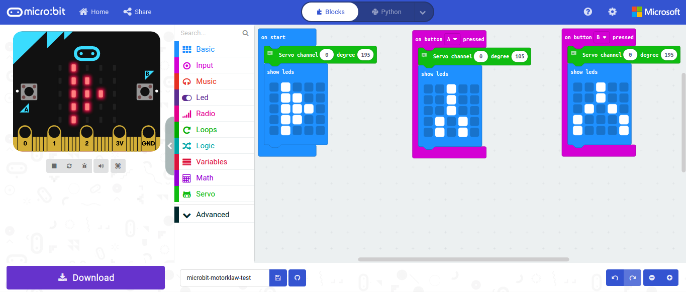

# Usage & purpose
This is used as a demo to control Kitronik :MOVE Motor Klaw using BBC micro:bit and Micro:Bit Servo Driver.

Work on the project here: https://makecode.microbit.org/_5cbE0sg4qTm6

The Python code in the repository and the HEX file are generated from "Microsoft MakeCode for micro:bit".

To flash the program on the micro:bit follow the instructions:

* https://microbit.org/get-started/first-steps/set-up/ (basically copy it to the USB flash memory drive)
* https://microbit.org/get-started/user-guide/overview/ (more introduction)

# Dependencies

* Hardware:
  * [BBC micro:bit](https://microbit.org/)
  * [Servo Driver for micro:bit](https://www.waveshare.com/wiki/Servo_Driver_for_micro:bit) (or similar)
  * [Kitronik :MOVE Motor Klaw Kit](https://kitronik.co.uk/products/5696-move-motor-klaw-kit)
* Software: web browser
